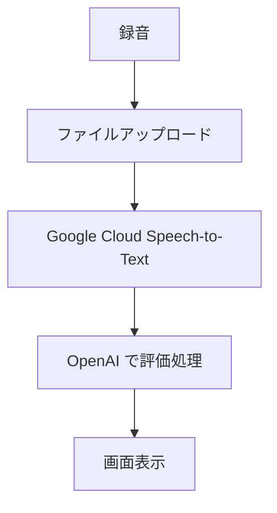
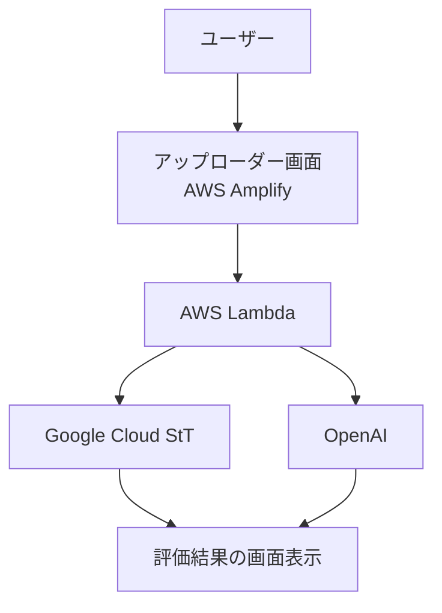

# 会議室 精密採点生成 AI サービス

## 自己紹介

（※省略）

---

## 目次

- 背景・目的
- 現状の課題
- サービス概要
- 競合他社・将来性について
- フローチャート
- システム構成図
- シーケンス図（※省略）

---

## 背景・目的

日本企業の会議では以下のような課題が頻発しています：

- 決まった人しか発言しない
- 立場の高い人が延々と話す
- 話が脱線して時間を無駄にしてしまう

このような課題を解決し、**自分の発言を振り返るための生成 AI アシスタントサービス**を提供します。

### 非生産的な会議の現状

- 無駄な会議時間が大量に発生している
- 士気の低下：「こんな会議なら参加したくない」

---

## 会議でよくある課題例

1. 会議の内容が脱線してしまう
2. 的外れの意見を言う PM
3. 話し合いに参加してくれない
4. 自分の主張を曲げない人がいる

> 一度に大人数の工数を使っている会議での時間の無駄は甚大！

---

## サービス概要

### 会議室 精密採点生成 AI サービスとは？

- 会議の発言内容を認識し、**話者ごとに発言・タイムチャートに基づく貢献度を採点**
- 「的外れな発言」や「どうでもいい話」を**正当に評価**
- 日々のプレゼンや議論における「良い癖・悪い癖」を**可視化**
- 利用者の**プレゼンテーション能力の向上**を支援

### 特徴的な分析軸（例）

- 確信度
- 安定度
- 雰囲気
- 影響力
- 人望
- 感情

---

### 発言内容評価の例

> 「発言が開始と終了の 2 回だけなのは、ファシリテーションとしてやや存在感が薄めです。中盤にも声をかけて議論を促すと、より効果的な進行ができますよ。」

---

## 競合他社・将来性について

- **競合他社**: 「あるわけない」
- **将来性**:
  - バズれば話題性も高い
  - プロンプトの追加開発により**企業の導入が期待可能**
  - **ビジネス用途への応用が容易**

---

## フローチャート（虎太郎案）

---

## システム構成図（虎太郎案）

---

※ シーケンス図の詳細は資料未記載
